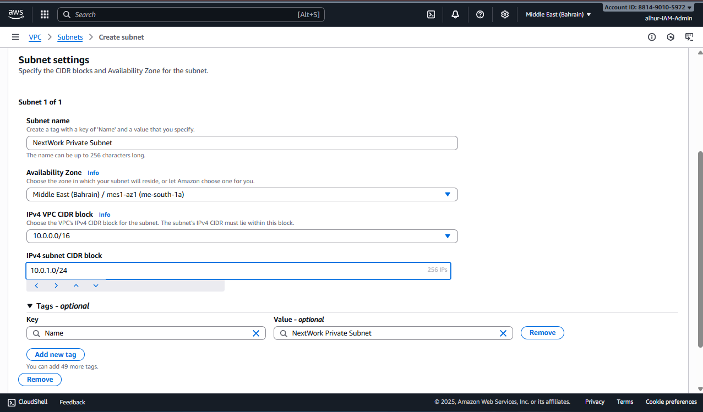
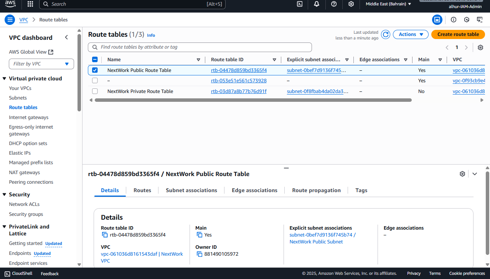
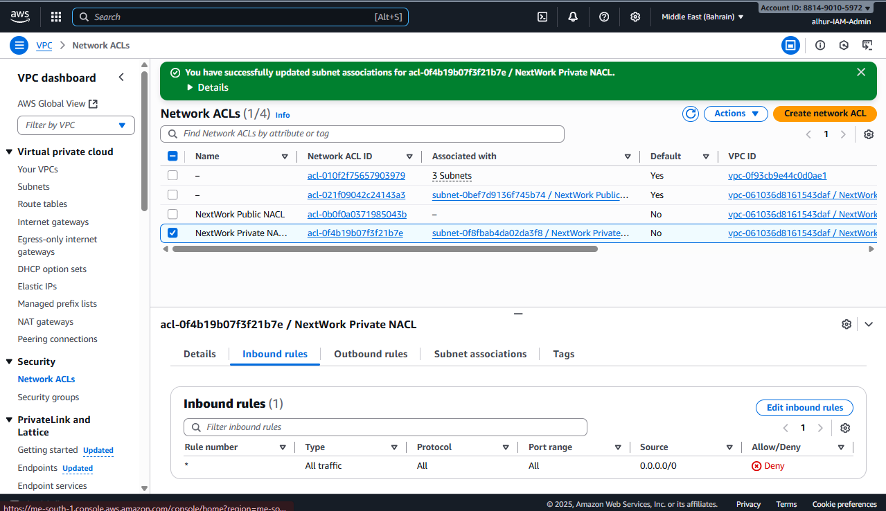

# NextWork AWS Networking Project 3 – Creating a Private Subnet

## ✅ Project Overview
In this project, I learned to **create a private subnet** inside my existing VPC.  
I attached a **dedicated route table** and set up a **custom network ACL** to keep the subnet isolated from the internet.

## 🛠 Key Services and Concepts
- **Amazon VPC** – Isolating resources inside a virtual private network.  
- **Private Subnet** – A subnet without direct internet access for secure workloads.  
- **Route Table** – Controlling traffic flow inside the VPC.  
- **Network ACL** – Adding an extra layer of security for inbound and outbound traffic.  
- **CIDR Blocks** – Defining the IP address range for the subnet.  

## 🔧 Steps Completed
1. **Created a private subnet** with a CIDR block separate from the public subnet.  
2. **Created a private route table** and associated it with the private subnet.  
3. **Set up a custom network ACL** for the private subnet, which denies all traffic by default.  

## 📌 Key Learnings
- Why **private subnets** are essential for sensitive resources like databases and internal services.  
- How **dedicated route tables** control traffic flow and keep private resources isolated.  
- How **network ACLs** provide an additional layer of security beyond route tables.  

## ⏱ Time Taken
This project took approximately **1 hour**.  
The most challenging part was **understanding NACL rules**, and the most rewarding part was **seeing the private subnet secured and isolated**.  

## 💡 Reflection
I chose this project to **learn how to protect resources inside a VPC**.  
It gave me hands-on experience in **network segmentation, security, and traffic management**, preparing me for more complex networking setups in upcoming projects.  

## 📂 Project Files
- Documentation: [`steps.pdf`](docs/steps.pdf)  
- Screenshots are in the `screenshots` folder.
