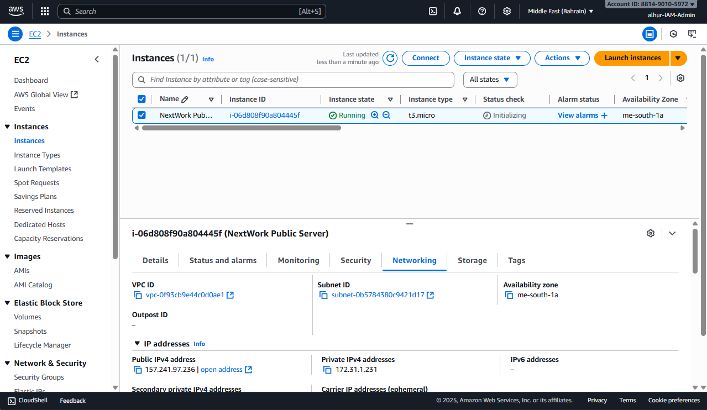
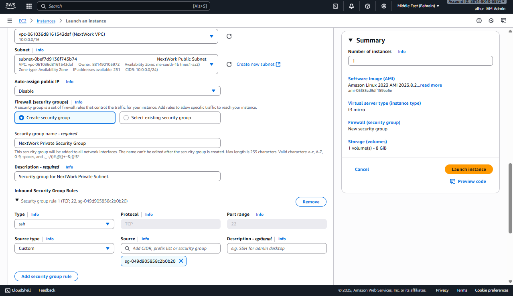
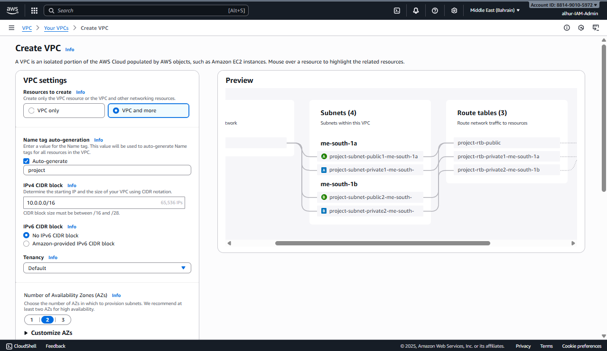
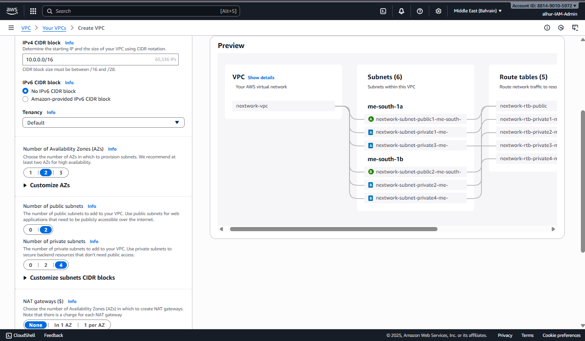

# NextWork AWS Networking Project 4 – Launching VPC Resources

## ✅ Project Overview
In this project, I learned to **launch EC2 instances** in both public and private subnets within my VPC.  
I explored **key networking concepts** like security groups, direct access with key pairs, and resource communication.

## 🛠 Key Services and Concepts
- **Amazon VPC** – Isolating resources inside a private virtual network.  
- **Subnets** – Dividing the VPC into public and private sections.  
- **Security Groups** – Controlling inbound and outbound traffic to EC2 instances.  
- **Key Pairs** – Enabling secure direct access to EC2 instances via SSH.  
- **Internet Gateway** – Allowing public instances to access the internet.  
- **NAT Gateway** – Allowing private instances to access the internet securely.  

## 🔧 Steps Completed
1. **Built VPC basics** – VPC, public/private subnets, route tables, IGW, security groups, and network ACLs.  
2. **Launched a public EC2 instance** – Created, assigned key pair, and configured networking for internet access.  
3. **Launched a private EC2 instance** – Secured it with a dedicated security group and enabled communication with the public instance.  
4. **Used VPC wizard** – Created a new VPC setup quickly and compared the resource map before and after launching instances.  

  

## 📌 Key Learnings
- How **public and private instances** behave differently inside a VPC.  
- The importance of **security groups** in restricting access.  
- Using **key pairs and SSH** for secure instance access.  
- How a **NAT gateway** allows private instances to access the internet safely.  
- The usefulness of the **VPC wizard** for quick setups.  

## ⏱ Time Taken
This project took approximately **1.5 hours**.  
The most challenging part was **configuring private instance access**, and the most rewarding part was **seeing both instances communicate securely**.

## 💡 Reflection
I chose this project to **gain hands-on experience launching and securing EC2 resources**.  
It reinforced concepts like **VPC design, subnets, and secure connectivity**, preparing me for the next projects in the series.

## 📂 Project Files
- Documentation: [`steps.md`](docs/steps.md)  
- Screenshots are in the `screenshots` folder.
